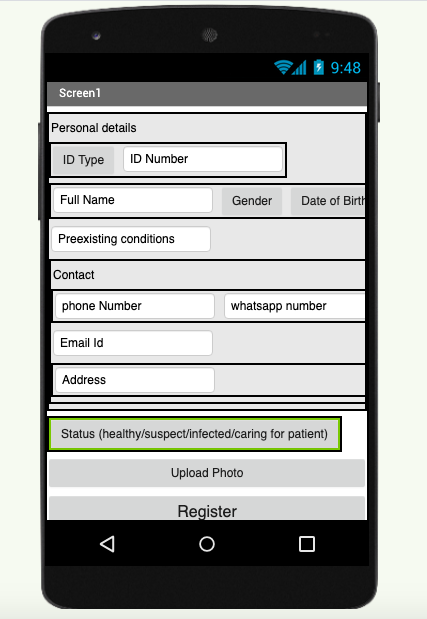
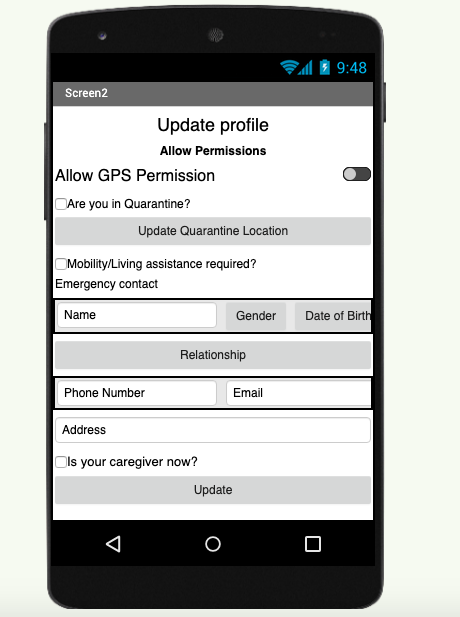
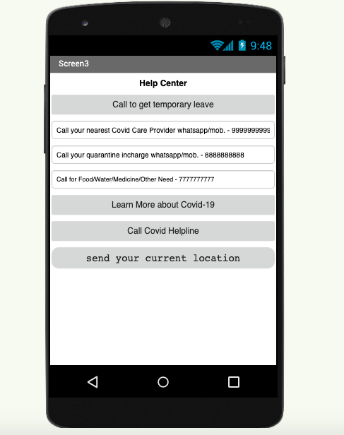

# Covid-FLutter
Flutter based mobile app for Covid case tracking, to be connected with rest api to send data on web

# Functionality

The primary purpose of this app is to track/verify home quarantine for COVID-19. Additional purpose includes regular health check ups, enabling food/water delivery, sample collection and contact tracing.

It has proven difficult to ensure that those under home quarantine will remain at home. There have been several instances of people violating quarantine. Health authorities have taken steps of stamping people's hands with indelible ink, this it doesn't enable tracking or verification. Hence, we are building a mobile app that will enable this.

The app will rely on these technical capabilities - geolocation, geofencing and voice/video communication.

# Unique Identity
Each person who enrolls into the app will enter personally identifying information. The information will be stored within the physical boundaries of the country and in compliance with the law of the land. 

For any country, acceptable identification includes:
- Driving license number (Issuing Authority + license number)
- Passport number (country + passport number)

For India, acceptable identification includes:
- Aadhaar card number
- OCI card number

For US, acceptable identification includes:
- Social security number, if no other ID is available. However, due to financial security reasons, other identifiers are preferred.

For countries not listed above, if they have a national ID, then the national ID number is preferred.

Any one of the above should be sufficient to uniquely identify an individual. Along with this id, the app needs:
- Full name
- Gender (male, female, other)
- Date of birth
- Electronic communication (1..n) {
    - Phone numbers (0...n)
    - Email address (0..n)
}
- Address (1..n)
- Photograph of the person
- Preexisting conditions
- Mobility or living assistance required? If yes, who is providing assistance (can be an emergency contact - listed below, or a health worker)

Emergency contact
- Name, gender, date of birth, relationship (parent, child, grandparent, grandchild, spouse, sibling, friend, other)
- Address, phone number, email
- Are they taking care of the quarantined person?

# Home Quarantine Tracking
- Is this person under quarantine - Yes/No (the need for this is explained below under contact tracing)
- Quarantine start date/time
- Quarantine end date/time
- Quarantine location: Quarantine authorities will whitelist the address where the person is quarantined. Since addresses in India can be hard to find, they can enter the approximate address in Google maps, then browse the map (in satellite view if needed), and then pin the location so that its latitude/longitude are captured along with the address.
- Local authority in charge of quarantine - this could be a district, city, town or village office. In version 1, make this free test. Subsequently, we can make this selectable with help from the government.
- Does this person need food, water or any medicines (for any health condition) during quarantine? Yes/No. (if yes, then the local authority will be responsible for delivering them periodically)
- Need for food/water
- The app will send location pings to the server every hour
- If the person leaves the geofence by 100 feet, then the app will send an alert to the server immediately
- Temporary leave from quarantine (in version 2) -   for hospitalization, or any other personal reasons that the quarantine officer approves. Start time, end time, permitted location, reason and who approved it. 

# Countermeasures against quarantine violation by bypassing the app
- Countermeasure 1: the authorities may text/video/voice call the person periodically to ensure that they answer the phone that is tracked, and the phone is indeed within the geofence and we may also send volunteer/healthcare worker to check on them and even a peer.
- Countermeasure 2: This will be an automation of countermeasure 1, perhaps in a future version. The app can automatically ask the person to use the front camera and record their picture. This picture can be compared with the picture on file (or with Aadhaar database if possible)
- Countermeasure 3: Do not install the phones that have the ability to manually set a location (for development purposes). If this can be done on rooted phones, then the app will check and alert if the phone is rooted. If the person has no other phone, then we will end up installing on this phone, but we will flag the phone as rooted so the server will know that the data may be unreliable.

# Communication between health authorities and quarantined individuals
The app will have text, audio and video capabilities. There are several reasons behind these features:
- Countermeasures against quarantine violation (see details above) - check if they are indeed within the geofence - they just didn't leave the tracking phone at home and go out with a different phone.
- Talk to them to reassure them, and do a quick history/visual examination by a health worker
- In a future version, enable the person to enter their symptoms (fever, cough, shortness of breath, etc.)
- Find out and deliver necessary supplies - food, water, medicines (e.g. for fever or preexisting conditions)
- Determine if a lab test is needed. If yes, then go to their home wearing PPE and take a swab for testing. This will help with containment compared to having the person visit a clinic/hospital

(more to come)

#Mockup
- 

- 

- 

Important linkes -
Pitch - https://bit.ly/CovidPitch  
Documentation - https://bit.ly/covidprojectdocs  
Source Code - http://bit.ly/Covid-Source  
Slack - http://bit.ly/Covid-Slack  
Blog - https://bit.ly/CovidProjectBlog  
